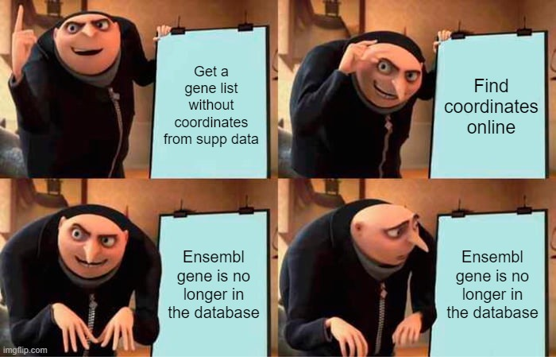

# genehtracker - Gene ID History Tracker



**New:** you can find the ECCB2022 poster [here](img/poster_eccb_hugo.pdf).

---
# Objectives

The main objectives of this project are:
1. Generate putative mappings for deprecated/retired ENSEMBL IDs
2. Retrieve latest coordinates for a list of ENSEMBL IDs
3. Find the complete (GENCODE) annotation history of a gene ID
4. Find the complete (GENCODE) annotation history of a gene symbol
5. Build locally an index of GENCODE annotations

---
# Installation

The project is being developed in Python 3. A conda environment could be setup as:

```bash
conda config --add channels defaults
conda config --add channels bioconda
conda config --add channels conda-forge
conda config --set channel_priority strict

conda install mamba -n base -c conda-forge

mamba create -n genehtracker python=3 nomkl pandas matplotlib networkx bedtools graphviz pygraphviz python-graphviz pydot ucsc-liftover seaborn 

```

---
# Tutorial
Please check the tutorial [here](tutorial.ipynb).

---
## TODO:
### Functionality
- [x] Add functions for finding gene ids
- [x] Allow figure size parameter
- [x] Save figures
- [x] Add helper classes
- [ ] Command line diagrams
- [ ] Command line tables

### Documentation
- [x] Tutorial for object oriented
- [ ] Tutorial for command line
- [x] Poster
- [x] Add new dependencies (python-Levenshtein, seaborn, python-graphviz, pydot, ucsc-liftover)
- [ ] Export environment to yml

### QoL
- [ ] Log messages while creating index
- [ ] Prefilter first and last genes to speed up intersection and index creation