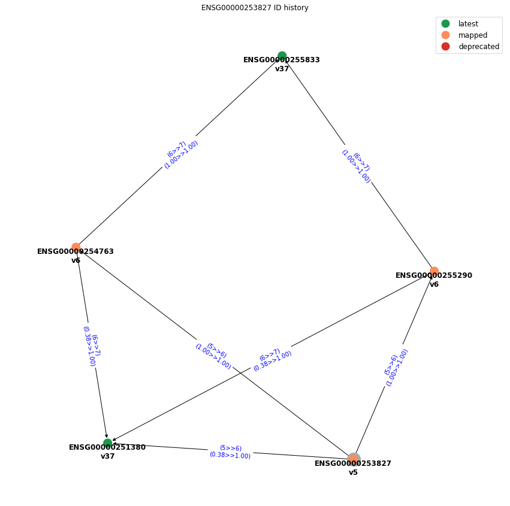

# genehtracker - Gene ID History Tracker

The main objectives of this project are:
1. Retrieve latest coordinates for a list of ENSEMBL IDs
2. Find the complete (GENCODE) annotation history of a gene ID
3. Find the complete (GENCODE) annotation history of a gene symbol
4. Generate putative mappings for deprecated/retired ENSEMBL IDs
5. Build locally an index of GENCODE annotations

The project is being developed in Python 3. A conda environment could be setup as:

```bash
conda config --add channels defaults
conda config --add channels bioconda
conda config --add channels conda-forge
conda config --set channel_priority strict

conda install mamba -n base -c conda-forge

mamba create -n genehtracker python=3 nomkl pandas matplotlib networkx bedtools graphviz pygraphviz 
```

---
## TODO:
### Functionality
- [ ] Add functions for finding gene ids
- [ ] Allow figure size parameter
- [ ] Save figures
- [ ] Add helper classes
- [ ] Command line diagrams
- [ ] Command line tables

### Documentation
- [ ] Tutorial for object oriented
- [ ] Tutorial for command line
- [ ] Poster
- [ ] Add new dependencies (python-Levenshtein, seaborn, python-graphviz, pydot, ucsc-liftover)
- [ ] Export environment to yml

### QoL
- [ ] Log messages while creating index
- [ ] Prefilter first and last genes to speed up intersection and index creation

---
# Showcase

### Import
```python
from genehtracker import GHTracker

GH = GHTracker(index_path='index')
GH.load_index()
GH.load_graph()

gene_list = [
    'ENSG00000230544',
    'ENSG00000240453',
    'ENSG00000254100',
    'ENSG00000259484',
    'ENSG00000259758',
    'ENSG00000260940',
    'ENSG00000261496',
    'ENSG00000261685',
    'ENSG00000266584',
    'ENSG00000122952',
    'ENSG00000253827'
]
```

### Query by gene list
```python
GH.query_by_geneid_list(gene_list)
```

| idx  | gene_shortid     | gene_id             | gene_name       | hgnc_id     | gene_type             | coord                         | gencode  | ensembl  | assembly  | date        | deprecated | 
|------|------------------|---------------------|-----------------|-------------|-----------------------|-------------------------------|----------|----------|-----------|-------------|------------| 
| 0    | ENSG00000122952  | ENSG00000122952.17  | ZWINT           | HGNC:13195  | protein_coding        | chr10:56357227-56361273(-)    | 37       | 103      | GRCh38    | 2020-12-07  | 0          | 
| 1    | ENSG00000230544  | ENSG00000230544.1   | LINC00453       | NaN         | lincRNA               | chr13:114586640-114588308(+)  | 18       | 73       | GRCh37    | 2013-09-02  | 1          | 
| 2    | ENSG00000240453  | ENSG00000240453.1   | RP11-206L10.10  | NaN         | processed_transcript  | chr1:810109-817712(-)         | 20       | 76       | GRCh38    | 2014-08-26  | 1          | 
| 3    | ENSG00000253827  | ENSG00000253827     | AC022092.1      | NaN         | protein_coding        | chr5:134779908-134788089(-)   | 5        | 60       | GRCh37    | 2010-12-07  | 1          | 
| 4    | ENSG00000254100  | ENSG00000254100.1   | AC069120.3      | NaN         | lincRNA               | chr8:38552248-38559020(-)     | 27       | 90       | GRCh38    | 2017-08-01  | 1          | 
| 5    | ENSG00000259484  | ENSG00000259484.1   | RP11-323F24.1   | NaN         | processed_transcript  | chr15:57151866-57210697(-)    | 17       | 72       | GRCh37    | 2013-06-17  | 1          | 
| 6    | ENSG00000259758  | ENSG00000259758.1   | CASC7           | NaN         | lincRNA               | chr8:140520156-140529501(-)   | 21       | 77       | GRCh38    | 2014-09-29  | 1          | 
| 7    | ENSG00000260940  | ENSG00000260940.1   | RP4-575N6.5     | NaN         | sense_overlapping     | chr1:101243158-101243749(+)   | 28       | 92       | GRCh38    | 2018-03-23  | 1          | 
| 8    | ENSG00000261496  | ENSG00000261496.1   | RP13-514E23.1   | NaN         | sense_overlapping     | chr4:86012296-86013874(-)     | 25       | 85       | GRCh38    | 2016-07-15  | 1          | 
| 9    | ENSG00000261685  | ENSG00000261685.2   | RP11-401P9.4    | NaN         | lincRNA               | chr16:50645809-50649249(+)    | 24       | 83       | GRCh38    | 2015-12-03  | 1          | 
| 10   | ENSG00000266584  | ENSG00000266584.1   | AL355149.1      | NaN         | miRNA                 | chr1:16548914-16548987(+)     | 24       | 83       | GRCh38    | 2015-12-03  | 1          | 


### Generate possible ID mappings
```python
GH.putative_mappings(gene_list)
```

| idx | query_id         | target_id        | query_coords                  | target_coords                | query_version  | target_version  | path                                  | 
|-----|------------------|------------------|-------------------------------|------------------------------|----------------|-----------------|---------------------------------------| 
| 0   | ENSG00000230544  | NaN              | chr13:114586640-114588308(+)  | NaN                          | 18             | -1              | NaN                                   | 
| 1   | ENSG00000240453  | ENSG00000230092  | chr1:810109-817712(-)         | chr1:800879-817712(-)        | 20             | 37              | (20>>37)(1.00>>0.45)                  | 
| 2   | ENSG00000254100  | ENSG00000253361  | chr8:38552248-38559020(-)     | chr8:38543276-38560877(-)    | 27             | 37              | (27>>37)(1.00>>0.38)                  | 
| 3   | ENSG00000254100  | ENSG00000196166  | chr8:38552248-38559020(-)     | chr8:38510834-38560939(-)    | 27             | 37              | (27>>37)(1.00>>0.14)                  | 
| 4   | ENSG00000259484  | ENSG00000137871  | chr15:57151866-57210697(-)    | chr15:56630176-56734086(-)   | 17             | 37              | (17>>18)(1.00>>0.20)                  | 
| 5   | ENSG00000259758  | NaN              | chr8:140520156-140529501(-)   | NaN                          | 21             | -1              | NaN                                   | 
| 6   | ENSG00000260940  | NaN              | chr1:101243158-101243749(+)   | NaN                          | 28             | -1              | NaN                                   | 
| 7   | ENSG00000261496  | NaN              | chr4:86012296-86013874(-)     | NaN                          | 25             | -1              | NaN                                   | 
| 8   | ENSG00000261685  | NaN              | chr16:50645809-50649249(+)    | NaN                          | 24             | -1              | NaN                                   | 
| 9   | ENSG00000266584  | NaN              | chr1:16548914-16548987(+)     | NaN                          | 24             | -1              | NaN                                   | 
| 10  | ENSG00000122952  | ENSG00000122952  | chr10:56357227-56361273(-)    | chr10:56357227-56361273(-)   | 37             | 37              |                                       | 
| 11  | ENSG00000253827  | ENSG00000251380  | chr5:134779908-134788089(-)   | chr5:135444214-135447348(-)  | 5              | 37              | (5>>6)(0.38>>1.00)                    | 
| 12  | ENSG00000253827  | ENSG00000255833  | chr5:134779908-134788089(-)   | chr5:135444226-135452351(-)  | 5              | 37              | (5>>6)(1.00>>1.00);(6>>7)(1.00>>1.00) | 

### Plot possible ID mappings
```python
GH.plot_gene_subtree('ENSG00000253827',output_img='img/map_example.png',output_gml='img/map_example.gml')
```

